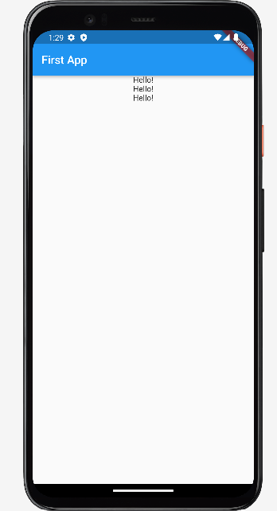

# What is Widget?
### Flutter 상에서의 위젯이란
1. UI를 만들고 구성하는 작은 프로그램
2. 눈에 보이지 않는 요소들까지 위젯
3. Everything is a widget

### State widget vs. Stateful widget
- Stateful → Value 값을 지속적으로 추적 보존(동적)
- Stateless → 이전 상호작용의 어떠한 값도 저장하지 않음(정적)

## Widget Tree
**특징**
1. Widget들은 Tree 구조로 정리될 수 있다
2. 한 Widget내에 얼마든지 다른 widget들이 포함될 수 있다
3. Widget은 부모 widget과 자식 widget으로 구성
4. Parent widget을 widget container라고 부르기도 한다

- MyApp, MyHomePage의 경우 꼭 이 이름이 아니여도 괜찮다
- Scaffold child의 경우 크게 AppBar와 Body로 나뉜다

# Flutter 앱 처음 만들기 step
1. Flutter material libary import 하기
2. void main 함수 불러오기
3. runApp 함수 불러오기
4. MyApp이라는 커스텀 argument 넣기 => Stateless

5. MyApp Stateless 위젯 생성
6. return값 MaterialApp으로 바꿔주기
7. title 작성
8. theme: ThemeDate()위젯 불러오기
9. primarySwatch 지정 불러오기 & 컬러 지정
10. home작성 => MyHomePage 커스텀argument 넣기

11. return 값 Scaffold로 바꿔주기
12. title argument Text 위젯으로 지정
13. body argument 작성 예시는 Center 위젯으로 만들었다
14. Center 위젯 안에 Column 위젯 작성

### 결과

