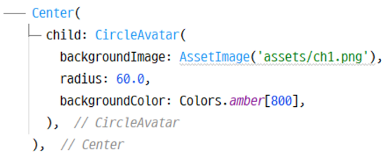
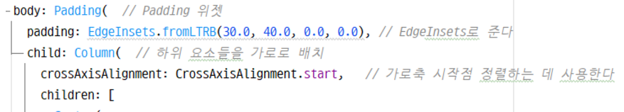
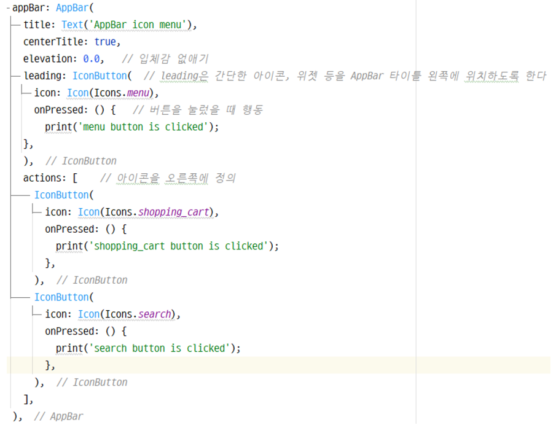
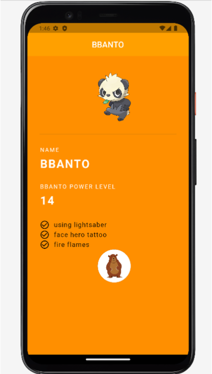

# Character app 만들기

## 하위 요소 넣는 방향

- Column: 세로 방향으로 배치
- Row: 가로 방향으로 배치

> 위의 두개는 하위에 여러개가 올 수 있어
> 
> 
> children argument를 선택한다
> 

## 원 모양으로 Image 넣기

1. assets 폴더를 생성한다
2. pubspec.yaml 파일에 assets 부분 주석 해제

❗들여쓰기 정말 중요하다 밑줄이 그어진다면 꼭 확인

1. CircleAvatar 위젯 지정 backgroudImage argument로 AssatImage()를 지정

## Padding 지정

1. Padding 위젯 생성
2. padding argument에 EdgeInsets 클래스를 통해 원하는 padding 방식으로 지정

> ➕ crossAxisAlignment를 사용해서 요소의 시작점 배치도 가능하다
> 

## App Bar icon button 넣기

- leading: 아이콘 버튼이나 같단한 위젯을 왼쪽에 배치할 때
- actions: 복수의 아이콘 버튼 등을 오른쪽에 배치할 때
- onPressed: 함수의 형해로 일반 버튼이나 아이콘 버튼을 터치했을 때 일어나는 이벤트를 정의

## 연습 결과

- appbar 연습 결과 이미지 내일 올리기
